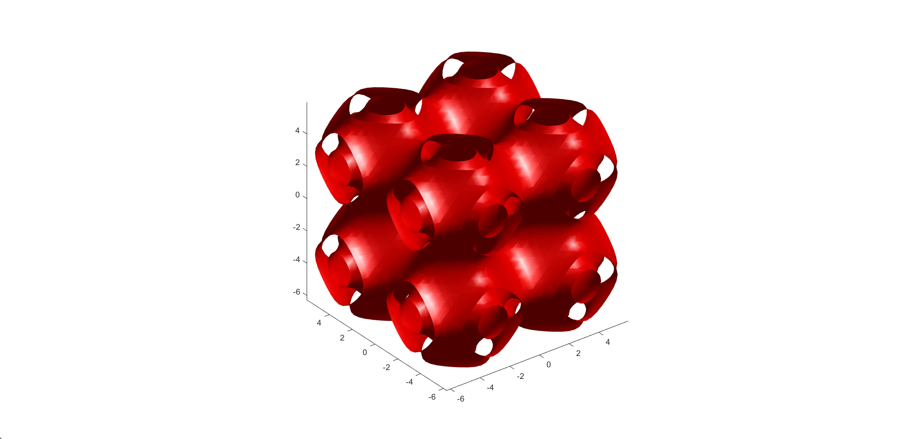

# TPMS-Modeler

## Clone the repo

```
git clone https://github.com/danielpmorton/TPMS-Modeler
```

## Usage

Both the [standard Matlab script](tpms_generator.m) and the [live script](tpms_generator_live.mlx) have the same functionality. Change around the input parameters and run the script - the STL will be saved to the `stls/` folder. 

Options to vary include:

- TPMS type: Schwarz, Gyroid, or Diamond
- Period of the TPMS structure (uniform or nonuniform in x/y/z)
- Mesh resolution
- Isovalue / bias between regions
- Rotation of the structure in the domain
- Thin vs thick structures
- Structure thickness

## Examples

### Gyroid


### Schwarz




### Diamond


